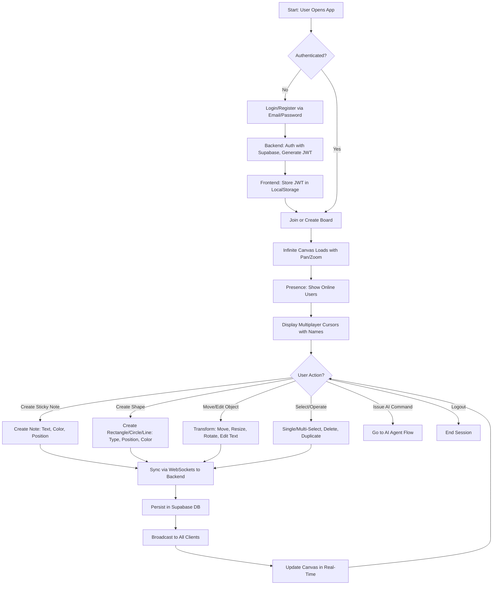
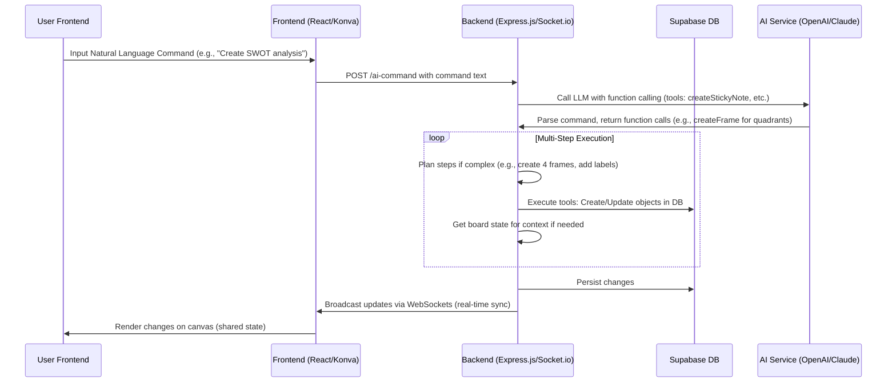

# CollabBoard

## Overview

CollabBoard is a real-time collaborative whiteboard application inspired by tools like Miro, built with an AI-first development approach. It features an infinite canvas for brainstorming, sticky notes, shapes, connectors, and an integrated AI agent that responds to natural language commands for creating and manipulating board elements. This project was developed as part of a one-week sprint challenge, emphasizing multiplayer synchronization, conflict resolution, and AI integration.

The application supports multiple users collaborating in real-time, with features like multiplayer cursors, presence awareness, and persistent board state. It is deployed with a backend on Render.com (free plan) using Express.js for AI handling, and frontend on Netlify.com using React and Konva.js for canvas rendering. Database and authentication are handled via Supabase (free tier).

This repository houses the source code, documentation, and deployment configurations for the project. It follows SOLID principles, modular design, and AI-assisted development workflows (primarily using Cursor).

**Project Status**: MVP complete with full features, AI agent, and documentation. Deployed publicly for testing.

## Features

### Core Whiteboard Features
- **Infinite Canvas**: Smooth pan and zoom functionality.
- **Sticky Notes**: Create, edit text, change colors, move, and resize.
- **Shapes**: Rectangles, circles, lines with customizable colors.
- **Connectors**: Lines/arrows to link objects.
- **Text Elements**: Standalone editable text.
- **Frames**: Group and organize content areas.
- **Transforms**: Move, resize, rotate objects.
- **Selection & Operations**: Single/multi-select, delete, duplicate, copy/paste.

### Real-Time Collaboration
- **Multiplayer Cursors**: Real-time cursor movement with user name labels.
- **Sync**: Instant object creation/modification for all users (<100ms latency).
- **Presence Awareness**: List of online users.
- **Conflict Resolution**: Last-write-wins with graceful handling.
- **Resilience**: Handles disconnects/reconnects; board state persists across sessions.
- **Performance**: 60 FPS during interactions; supports 500+ objects and 5+ users.

### AI Board Agent
- Supports 6+ natural language commands across categories:
  - **Creation**: e.g., "Add a yellow sticky note that says 'User Research'".
  - **Manipulation**: e.g., "Move all pink sticky notes to the right side".
  - **Layout**: e.g., "Arrange these sticky notes in a grid".
  - **Complex**: e.g., "Create a SWOT analysis template".
- Shared state: AI changes sync in real-time for all users.
- Latency: <2 seconds for simple commands.
- Tool Schema: Includes functions like `createStickyNote`, `moveObject`, `getBoardState`.

### Development Highlights
- **AI-First Workflow**: Used Cursor for code generation; documented in AI Development Log.
- **Cost Analysis**: Tracked dev costs; projections for scaling (e.g., $0/month for 100 users on free tiers).
- **Testing**: Multi-browser sync tests, network throttling.

## Tech Stack

- **Backend**: Node.js/Express.js, Socket.io for WebSockets, Supabase for DB/Auth/Real-time.
- **Frontend**: React, Konva.js for canvas, React-Konva for integration.
- **AI**: OpenAI GPT-4 or Anthropic Claude with function calling.
- **Deployment**: Backend on Render.com (free), Frontend on Netlify.com (manual deploy with netlify.toml).
- **Other**: Jest for testing, ESLint for linting (manual, no Husky).

Alternative options considered: Firebase, AWS, Vanilla JS.

## Architecture Diagrams

### User Flow


### AI Agent Flow


(Additional diagrams like System Architecture, Data Sync Flow, etc., are documented in `docs/PRD.md`.)

## Installation & Setup

### Prerequisites
- Node.js >=18
- Supabase account (free tier)
- OpenAI/Anthropic API key
- Git

### Local Development
1. Clone the repo:
   ```
   git clone https://github.com/decagondev/colab123.git
   cd colab123
   ```
2. Install dependencies:
   - Backend: `cd backend && npm install`
   - Frontend: `cd frontend && npm install`
3. Set environment variables:
   - Create `.env` in backend: SUPABASE_URL, SUPABASE_KEY, OPENAI_API_KEY, etc.
   - See `.env.example` for details.
4. Run backend: `cd backend && npm start` (starts Express server with Socket.io).
5. Run frontend: `cd frontend && npm start` (starts React app).
6. Access at `http://localhost:3000` (frontend) and test sync with multiple tabs.

### Deployment
- **Backend**: Push to Render.com (free web service); auto-deploys from GitHub.
- **Frontend**: Build with `npm run build`, manual deploy to Netlify via UI. Use provided `netlify.toml`:
  ```
  [build]
  command = "npm run build"
  publish = "build"

  [[headers]]
  for = "/*"
  [headers.values]
  Access-Control-Allow-Origin = "*"

  [[redirects]]
  from = "/*"
  to = "/index.html"
  status = 200
  ```

## Usage

1. Sign up/login via email/password.
2. Create/join a board.
3. Add elements (notes, shapes) via toolbar or AI chat input (e.g., "Add a blue rectangle").
4. Collaborate: Invite users; see real-time updates.
5. Test AI: Issue commands like "Create a user journey map".

For full testing scenarios, see `docs/Pre-Search.md`.

## Documentation

- **PRD.md**: Product Requirements Document with epics, user stories, tasks.
- **Pre-Search.md**: Architecture decisions and constraints.
- **AI-Dev-Log.md**: AI tools used, prompts, learnings.
- **AI-Cost-Analysis.md**: Dev costs and projections.
- **Capstone-Defense.md**: Architecture summary, demo script.

All in `/docs/` directory.

## Contributing

Follow branch naming: `feature/epic-us-feature`. Use SOLID/modular code. No Husky; manual lint. Pull requests welcome!

## License

This project is licensed under the MIT License - see the [LICENSE](LICENSE) file for details.

## Acknowledgments

Built for Gauntlet AI challenge. Inspired by Miro. Thanks to Cursor for AI assistance.
