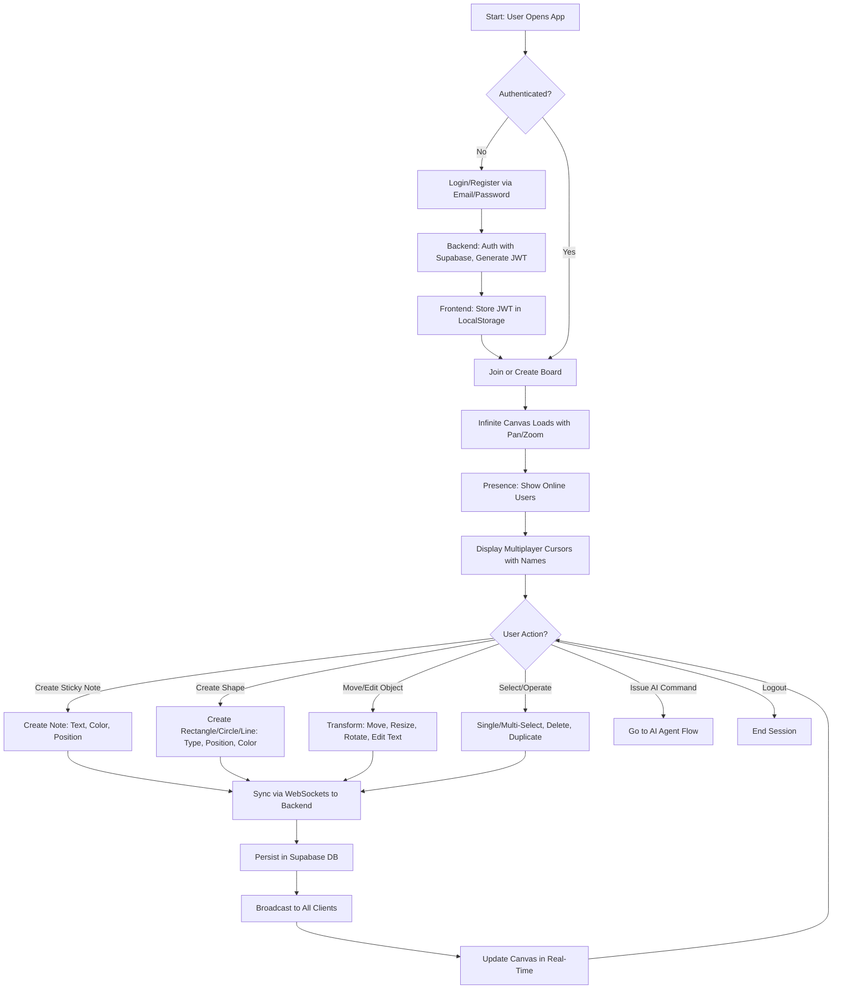
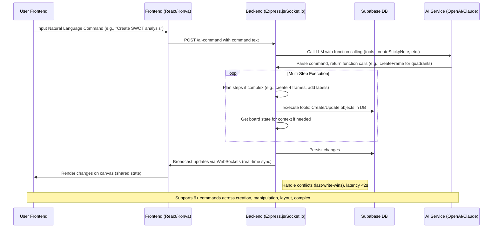
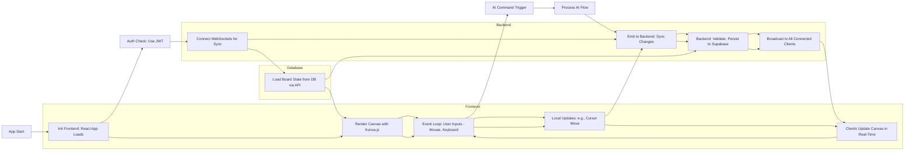
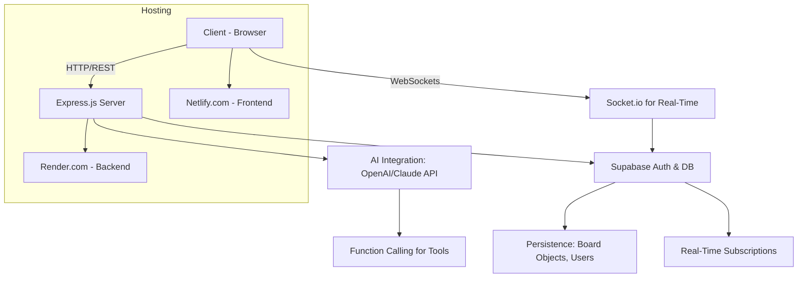
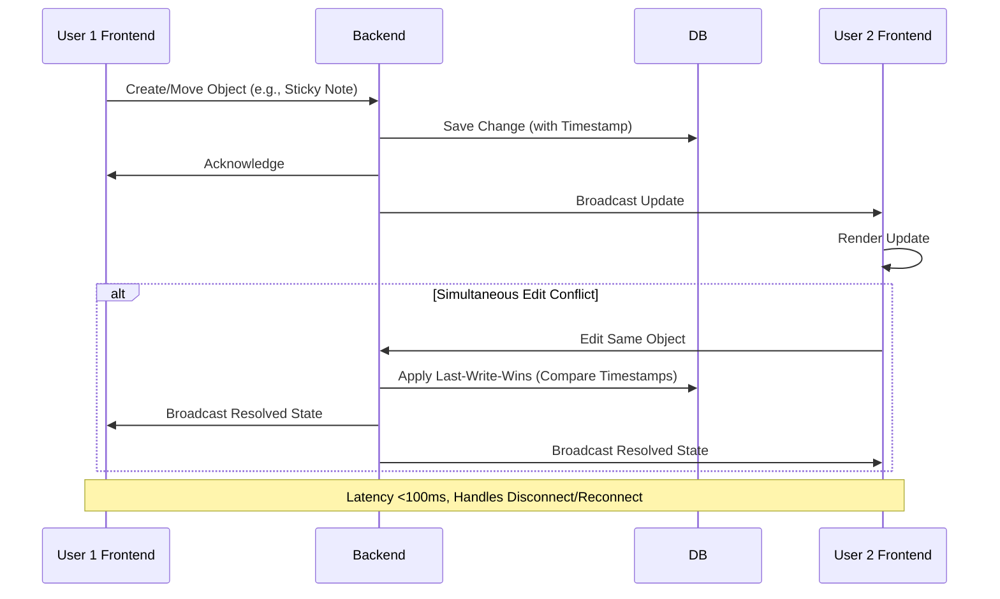
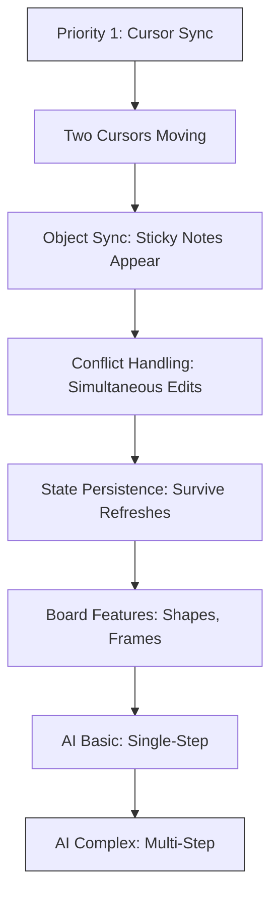
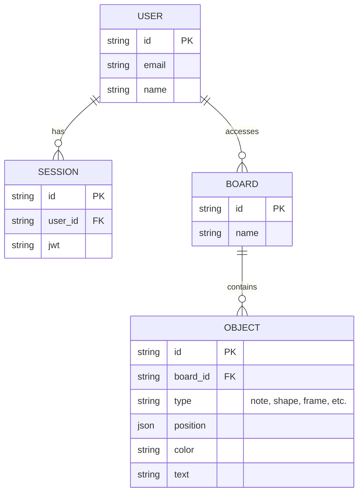

# Diagrams

### User Flow Diagram
This flowchart illustrates the end-user journey in CollabBoard, from authentication to real-time collaboration. It follows a top-down structure for clarity, with decision points and loops for ongoing interactions. Branches represent modular user actions aligned with SOLID principles (e.g., separate concerns for auth, sync, and object manipulation).

### AI Agent Flow Diagram
This sequence diagram details the AI agent's processing pipeline, emphasizing modularity (e.g., separate AI module in backend). It shows synchronous and asynchronous interactions, with loops for multi-step commands. Best practices include actor labels, notes for performance targets, and clear request-response flows to highlight dependency inversion (AI client injected).

### General Program Flow Diagram
This high-level flowchart depicts the overall application lifecycle and data flow, using subgraphs for modular components (frontend, backend, DB). It incorporates loops for continuous collaboration and branches for AI integration. Follows left-to-right progression with color-coding for start/loop points.

### System Architecture Diagram
A component diagram showing high-level modules and connections. Uses graph TD for directional flows, with subgraphs for deployment. Best practices: Simple nodes, arrows for data flow, notes for key features.

### Real-Time Data Sync Flow Diagram
Sequence diagram focused on collaboration sync, including conflict resolution. Highlights resilience and performance targets with notes and alt branches.

### Build Strategy Flow Diagram
Simple flowchart based on the spec's priority order, with progressive stages. Color-coded start/end for emphasis.

### Entity-Relationship Diagram (Data Model)
An ER diagram outlining key data entities for persistence. Aligns with modular design, showing relationships for board objects.

These diagrams provide a comprehensive visual overview of CollabBoard. Each uses Mermaid's best practices: consistent syntax, descriptive labels, and appropriate diagram types (flowchart for processes, sequence for interactions, ER for data). They are based on the project spec, PRD, and stack (e.g., Supabase, Express.js, React/Konva).
